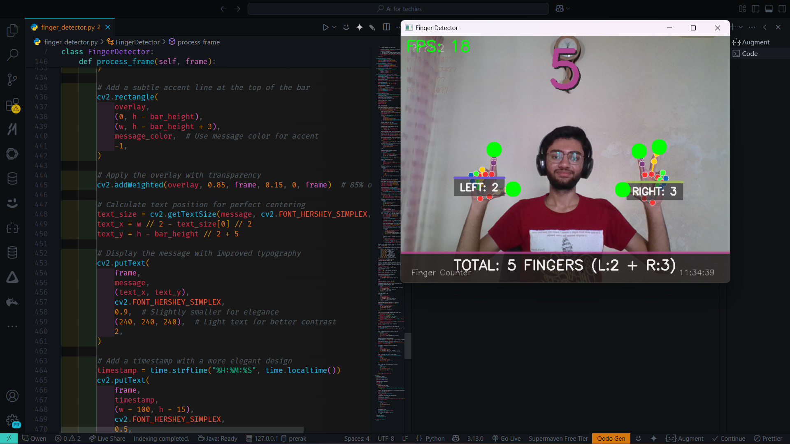

# Finger Detector 👋✌️


A Python application that uses computer vision to detect and count fingers in real-time using a webcam. This project demonstrates how to use MediaPipe and OpenCV for hand tracking and finger counting with a clean, user-friendly interface.

<div align="center">



*Screenshot of the Finger Detector application in action*

</div>

## ✨ Features

- **Real-time finger detection** and counting with high accuracy
- **Multi-hand support** - works with one or two hands simultaneously
- **Visual feedback** with color-coded information for each hand
- **Elegant UI** with status messages, timestamps, and FPS counter
- **Robust detection algorithm** that works in various lighting conditions
- **Adaptive thresholds** based on hand size for more reliable detection

## 📋 Requirements

- **Python 3.6+**
- **OpenCV** for image processing and UI
- **MediaPipe** for hand landmark detection
- **Webcam** for real-time video input

## 🗂️ Project Structure

```
finger-detector/
├── .gitignore           # Git ignore file
├── LICENSE              # MIT License
├── README.md            # Project documentation
├── main.py              # Application entry point
├── requirements.txt     # Python dependencies
├── setup.py             # Package installation script
└── src/                 # Source code directory
    ├── __init__.py      # Package initialization
    └── finger_detector.py  # Core finger detection logic
```

## 🚀 Installation

### Prerequisites

Before installing, make sure you have:
- Python 3.6 or higher installed
- A working webcam connected to your computer
- Sufficient permissions to install Python packages

### Method 1: Using pip (Recommended)

```bash
# Clone the repository
git clone https://github.com/PrerakPithadiya/finger-detector.git
cd finger-detector

# Install the package and dependencies
pip install -e .
```

### Method 2: Using requirements.txt

```bash
# Clone the repository
git clone https://github.com/PrerakPithadiya/finger-detector.git
cd finger-detector

# Install dependencies
pip install -r requirements.txt
```

### Troubleshooting Installation

If you encounter issues with MediaPipe installation:

```bash
# For Windows users who encounter MediaPipe installation issues
pip install mediapipe-silicon

# For specific OpenCV version requirements
pip install opencv-python==4.5.4.60
```

## 🎮 Usage

### Running the Application

After installation, run the application with:

```bash
python main.py
```

### Controls and Interaction

- Position your hand(s) in front of the webcam
- The application will automatically detect and count extended fingers
- Different hand gestures will be recognized and counted in real-time
- Press `q` to exit the application

### Understanding the Display

- **Top left**: FPS counter and hand detection status
- **Near each hand**: Hand type (Left/Right) and finger count
- **Bottom bar**: Status message showing total finger count
- **Bottom right**: Current timestamp

## 🔍 How it Works

This application uses a combination of computer vision techniques to accurately detect and count fingers:

1. **Hand Detection**: MediaPipe's hand tracking solution identifies 21 key landmarks on each hand

2. **Landmark Analysis**: The application processes these landmarks to determine finger positions

3. **Finger Extension Detection**: For each finger, the system:
   - Calculates angles between finger joints
   - Measures distances between fingertips and palm center
   - Applies adaptive thresholds based on hand size
   - Uses special logic for thumb detection (which behaves differently)

4. **Visual Feedback**: Results are displayed with an intuitive UI that shows:
   - Individual finger counts for each hand
   - Total finger count across all detected hands
   - Color-coded information based on the number of extended fingers

## 🧠 Advanced Features

### Robust Thumb Detection

The application uses a specialized algorithm for thumb detection that considers:
- The unique movement pattern of the thumb
- The angle between thumb joints
- The distance from thumb tip to palm and index finger

### Adaptive Thresholds

The detection algorithm automatically adjusts to different hand sizes by:
- Measuring hand dimensions in real-time
- Scaling distance thresholds proportionally
- Applying different angle thresholds for different fingers

## 🤝 Contributing

Contributions are welcome! If you'd like to improve the project:

1. Fork the repository
2. Create a feature branch (`git checkout -b feature/amazing-feature`)
3. Commit your changes (`git commit -m 'Add some amazing feature'`)
4. Push to the branch (`git push origin feature/amazing-feature`)
5. Open a Pull Request

## 👨‍💻 Author

**Prerak Pithadiya**
- Email: prerakpithadiya@gmail.com
- GitHub: [PrerakPithadiya](https://github.com/PrerakPithadiya)

## 📄 License

This project is licensed under the MIT License - see the [LICENSE](LICENSE) file for details.

## 🧪 Testing

To test the application and verify it's working correctly:

1. **Basic Functionality Test**:
   - Run the application with `python main.py`
   - Show different numbers of fingers to the camera
   - Verify the finger count updates correctly
   - Test with both hands in the frame simultaneously

2. **Performance Testing**:
   - Check the FPS counter in the top-left corner
   - Typical performance should be 15-30 FPS on modern hardware
   - If FPS drops below 10, consider reducing video resolution

3. **Lighting Conditions**:
   - Test in different lighting conditions
   - The application should work best in well-lit environments
   - Avoid strong backlighting which can create silhouettes

4. **Hand Positioning**:
   - Test with hands at different distances from the camera
   - Optimal distance is typically 20-80 cm from the camera
   - Ensure your full hand is visible in the frame

## 🔮 Future Work

Potential enhancements for future versions:

1. **Gesture Recognition**:
   - Implement recognition of common gestures (thumbs up, peace sign, etc.)
   - Add customizable gesture commands

2. **UI Improvements**:
   - Create a more interactive dashboard
   - Add settings panel for adjusting detection parameters
   - Implement dark/light mode toggle

3. **Performance Optimization**:
   - Optimize for lower-end hardware
   - Add GPU acceleration options

4. **Additional Features**:
   - Hand distance estimation
   - 3D hand pose visualization
   - Integration with other applications via API

5. **Cross-Platform Support**:
   - Create mobile versions (Android/iOS)
   - Develop web-based version using WebRTC

## 🎓 Academic Context

This project was developed as part of my coursework for the Computer Engineering diploma program at Noble University. It demonstrates the practical application of computer vision concepts and programming skills acquired during my studies.

The implementation uses industry-standard libraries (MediaPipe and OpenCV) to solve a real-world computer vision problem, showcasing both technical skills and creative problem-solving abilities.

## 🙏 Acknowledgements

- [MediaPipe](https://google.github.io/mediapipe/) for their excellent hand tracking solution
- [OpenCV](https://opencv.org/) for computer vision capabilities
- All contributors and users of this project
- My professors at Noble University for their guidance and support
